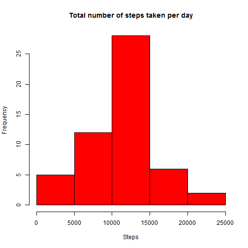
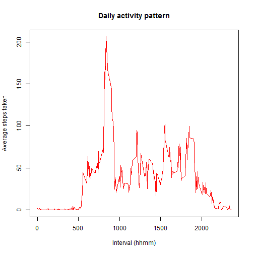
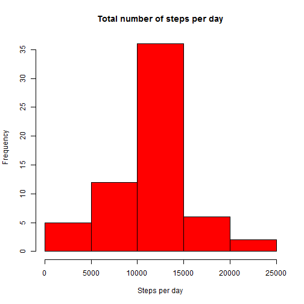
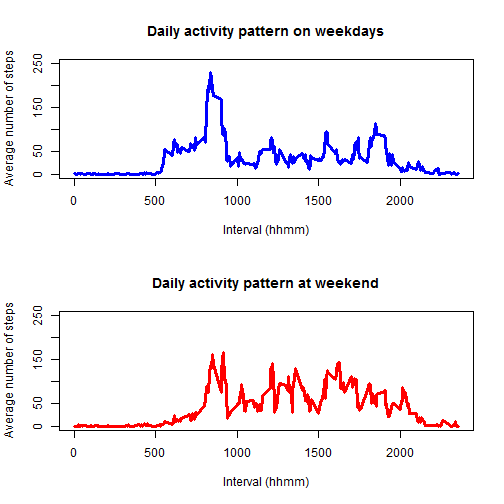

## Loading and preprocessing the data
It is assumed that the file are unzip and extracted to the working directory.Then load the required libraries and files.

```r
library(ggplot2)
library(knitr)
library(lubridate)
library(dplyr)
file<-"activity.csv"
MyData<-read.csv(file,header = TRUE, sep = ",")
```


## What is mean total number of steps taken per day?
The missing values in the dataset is ignored on this step. Then calculate sum steps by day.

```r
MyData<-group_by(MyData,date)
Sum_StepsDay <- summarise(MyData, steps = sum(steps))
Sum_StepsDay <-na.omit(Sum_StepsDay)

hist(Sum_StepsDay$steps, main = "Total number of steps taken per day", 
     xlab = "Steps", ylab = "Frequency"
     ,col="red")
```

 

Next, calculate the mean and median.

```r
options(scipen=999)
mean_steps<-mean(Sum_StepsDay$steps, na.rm = TRUE)
```
The mean of steps taken is 10766.1886792.

```r
median_steps<-median(Sum_StepsDay$steps, na.rm = TRUE)
```
The median of steps taken is 10765.

## What is the average daily activity pattern?
Make a time series plot (i.e. type = "l") of the 5-minute interval (x-axis) and the average number of steps taken, averaged across all days (y-axis). 

```r
MyData <- transform(MyData, interval = factor(interval))
MyData<-group_by(MyData,interval)
Mean_StepsInterval <- summarise(MyData, steps = mean(steps,na.rm=TRUE))
```


```r
plot(levels(as.factor(Mean_StepsInterval$interval)), Mean_StepsInterval$steps, 
     type="l", col="red", lwd=1, 
     main="Daily activity pattern", 
     xlab="Interval (hhmm)", ylab="Average steps taken")
```

 


```r
MaxSteps<-Mean_StepsInterval[match(max(Mean_StepsInterval$steps),Mean_StepsInterval$steps),]
```
Referring to the plot above, the interval 835, 206.1698113 contains the maximum steps

## Imputing missing values
Note that there are a number of days/intervals where there are missing values (coded as NA). The presence of missing days may introduce bias into some calculations or summaries of the data.

First we calculate total number of missing values in the dataset.

```r
number_na<-sum(is.na(MyData))
```
Total number of missing values is 2304.

Secondly, we choose the value of mean/average(steps per 5-min interval) calculated from above step to be use as imputation method. We started by creating new dataset.

```r
MyData_noNAs<-read.csv("activity.csv" )
class(MyData_noNAs$interval)<-"numeric"
```

Next, we create new dataset with imputed values

```r
i<-1
for (i in 1:dim(MyData_noNAs)[1]){
        if (is.na(MyData_noNAs[i,1])){
                r<-match(MyData_noNAs[i,3],Mean_StepsInterval$interval)
                MyData_noNAs[i,1]<-Mean_StepsInterval[r,2]
                }
        i=i+1
} 
```

Finally, we create the histogram.

```r
Sum_StepsDay_noNAs <- tapply(MyData_noNAs$steps, MyData_noNAs$date, sum, na.rm = TRUE)
hist(Sum_StepsDay_noNAs, main = "Total number of steps per day", 
    xlab = "Steps per day", ylab = "Frequency"
    ,col="red")
```

 

Yes, different

```r
mean_noNAs<-mean(Sum_StepsDay_noNAs)
```
The mean with no NA of steps taken is 10766.1886792.

```r
median_noNAs<-median(Sum_StepsDay_noNAs)
```
The median with no NA of steps taken is 10766.1886792.
Mean and median value did not change compared to the calculation above. This is because the dataset contains NAs for for complete days. Since these values are substituted by mean values nothing changes during mean and median calculation.

## Are there differences in activity patterns between weekdays and weekends?
The following identifies the particular day in the week for each date in the data frame.

```r
MyData_noNAs<-mutate(MyData_noNAs, date_day=wday(date))
MyData_weekday<-subset(MyData_noNAs,date_day>1 & date_day<7)
MyData_weekday <- transform(MyData_weekday, interval = factor(interval))
MyData_weekday<-group_by(MyData_weekday,interval)
mean_steps_interval_weekday <- summarise(MyData_weekday, steps = mean(steps,na.rm=TRUE))

MyData_weekday<-subset(MyData_noNAs,date_day==1 | date_day==7)
MyData_weekday <- transform(MyData_weekday, interval = factor(interval))
MyData_weekday<-group_by(MyData_weekday,interval)
mean_steps_interval_weekend <- summarise(MyData_weekday, steps = mean(steps,na.rm=TRUE))


par(mfrow = c(2, 1))
plot(levels(as.factor(mean_steps_interval_weekday$interval)), mean_steps_interval_weekday$steps, 
     type="l", col="blue", lwd=3, ylim=c(0,250),
     main="Daily activity pattern on weekdays", 
     xlab="Interval (hhmm)", ylab="Average number of steps")

plot(levels(as.factor(mean_steps_interval_weekend$interval)), mean_steps_interval_weekend$steps, 
     type="l", col="red", lwd=3, ylim=c(0,250),
     main="Daily activity pattern at weekend",
     xlab="Interval (hhmm)", ylab="Average number of steps")
```

 
There is different for pattern in weekday and weekend.
